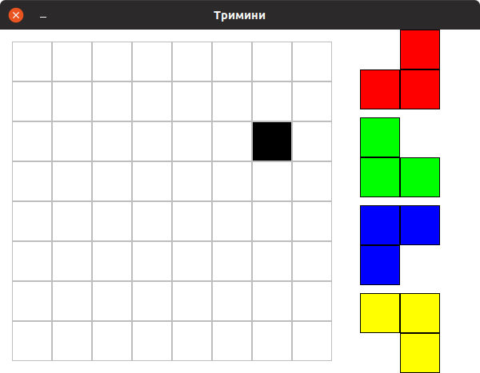
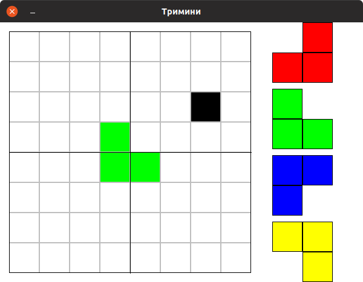
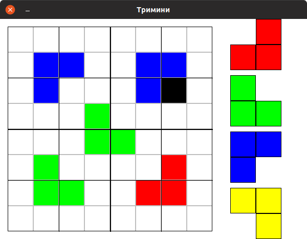
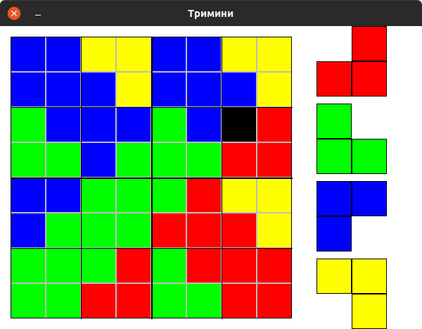

..
  4.0 Подели па владај - увод
  reading

Подели па владај - увод на примеру тримина
==========================================

У већини претходних задатака рекурзијом је неки дати проблем свођен на
проблем мање димензије, све док димензија није постала таква да се
проблем може једноставно директно решити. У многим ситуацијама се
проблем може разложити не на један, него на више проблема који су
неколико пута мањи него што је полазни проблем. Оваква решења су често
веома ефикасна, па се та техника назива *"подели-па-владај"*
(енгл. *divide-and-conquer*).

Тримини
-------

Илуструјмо технику подели-па-владај једним једноставним примером.

.. questionnote::

   Нека је дата табла димензије :math:`8 \times 8` на којој недостаје
   једно поље. Задатак је попунити преостала 63 поља триминима
   (облицима који се добију када се из квадрата димензије :math:`8
   \times 8` избаци једно поље).

Покушајте и сами да одиграте једну партију `овде <Trimini.html>`__.
           
Насумичним слагањем тримина, без неке стратегије, тешко да задатак
може да се реши (обично на самом крају остане неколико поља која се не
могу попунити). Задатак се може јако елегантно решити наредним
рекурзивним поступком. Табла димензије :math:`8 \times 8` се може
разложити на 4 табле димензије :math:`8 \times 8`. Постављањем једног
тримина можемо постићи да у свакој од те 4 табле недостаје по један
тримино.
           

   
Након тога, сваки од 4 потпроблема решавамо рекурзивно. Свака табла
димензије :math:`4 \times 4` се може разложити на 4 табле димензије
:math:`2 \times 2`. Постављањем једног тримина можемо постићи да у
свакој од те 4 табле недостаје по један тримино.

На крају, сваку таблу димензије :math:`2 \times 2` којој недостаје
једно поље можемо једноставно попунити постављањем одговарајућег
тримина.

Наредни C# програм решава тримино на основу управо описаног алгоритма.
Табла је представљена као матрица у којој се тримини приказују
бројевима. Приликом исписа уместо бројева пишу се мала слова енглеске
абецеде.

Рекурзивној функцији је уз тренутно стање табле и број наредног
тримина који се поставља (та променљива се прослеђује по референци,
јер се током рекурзије мења и представља улазно-излазни параметар
функције) морају проследити аргументи који описују правоугаоник који
се тренутно попуњава и положај недостајућег (већ попуњеног) поља.
Правоугаоник се описује координатама (бројем врсте и колоне) његовог
горњег левог темена и димензијом.

.. activecode:: trimini_cs
    :passivecode: true
    :coach:
    :includesrc: _src/rekurzija/trimini.cs
