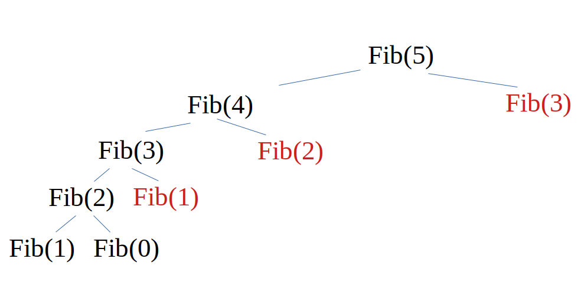

Увод у динамичко програмирање - Фибоначијев низ
===============================================

.. questionnote::

   Пчела матица носи јајашца. Ако трут оплоди јајашце пчеле, тада се
   из њега рађа женска пчела. Ако се јајашце не оплоди, онда се из
   њега излеже трут. Дакле, женска пчела има два родитеља, док трут
   има само једног (он нема оца, већ само мајку). Пчела има две баке
   (мамину и татину маму) и једног деду (маминог тату), док трут има
   једну баку и једног деду (мамине родитеље). Напиши програм који
   одређује колико предака у некој генерацији има трут.

На наредној слици је број пчела у генерацији обележен зеленом бојом,
број трутова плавом бојом, а укупан број предака црвеном бојом.
   

   

Обележимо са :math:`f^m_n` број мушких предака које трут има у
генерацији :math:`n` и :math:`f^z_n` број женских предака које трут
има у генерацији :math:`n`.  Важи да је :math:`f^m_0 = 1` и
:math:`f^z_0 = 0` (у тој генерацији је само трут). За свако :math:`i
\geq 0` важи :math:`f^m_{i+1} = f^z_i`, јер само женске јединке имају
очеве, док је :math:`f^z_{i+1} = f^m_i + f^z_i`, јер и мушке и женске
јединке имају мајке. Обележимо са :math:`f_n = f^m_n + f^z_n` укупан
број предака трута у генерацији :math:`n`. Користећи ту ознаку, имамо:

.. math::

    \begin{align} \\
    f_0 &= f^z_0 + f^m_0 = 0 + 1 = 1\\
    f_1 &= f^z_1 + f^m_1 = 1 + 0 = 1\\
    \end{align}
    
а за свако :math:`i \geq 0` важи

.. math::

    \begin{align} \\
    f_{i+2} &= f^z_{i+2} + f^m_{i+2}\\
    &= (f^m_{i+1} + f^z_{i+1}) + (f^z_{i+1})\\
    &= f_{i+1} + f_i\\
    \end{align}

На основу овога можемо да закључимо да број предака задовољава услове
чувеног Фибоначијевог низа бројева у којем је сваки наредни елемент
једнак збиру претходна два.

На основу ове дефиниције веома је једноставно направити рекурзивну
имплементацију.

.. code-block:: csharp

   using System;
    
   class Program
   {
      static long Fib(int n)
      {
         if (n <= 1)
	    return 1;
	 return Fib(n-1) + Fib(n-2);
      }

      static void Main()
      {
          int n = int.Parse(Console.ReadLine());
          Console.WriteLine(Fib(n));
      }
   }
	   
Нажалост, услед преклапања рекурзивних позива, ова имплементација је
веома неефикасна. На наредној слици приказано је дрво које илуструје
рекурзивне позиве који се извршавају. Лако се примећује да се многи
рекурзивни позиви понављају (број понављања позива за параметре 5, 4,
3, 2 и 1 је 1, 1, 2, 3, 5 и може се приметити да број позива
представља елементе Фибоначијевог низа, који расте експоненцијално
брзо).

   
Иако се до бољег решења може доћи уз мало једноставног програмерског
размишљања, без познавања неке напредне програмерске технике, у
наставку ћемо шаблонски применити технику динамичког програмирања да
бисмо је упознали и да бисмо могли да је применимо и у тежим задацима
који следе.

Мемоизација (динамичко програмирање наниже)
-------------------------------------------

Основна идеја технике динамичког програмирања наниже је да се употреби
нека структура података у којој ће се памтити резултати рекурзивних
позива за разне вредности аргумената функције (ако функција има један
параметар то је обично низ, ако има два то је обично матрица, за више
параметара се користи вишедимензионални низ, а у свим случајевима
могуће је употребити и неки облик мапе тј. речника). При улазу у тело
рекурзивне функције проверава се да ли је текући рекурзивни позив
раније био извршен и ако јесте, тада се вредност очитава из помоћне
структуре података. У супротном се вредност израчунава на основу
основне рекурзивне дефиниције и пре него што се врати позиваоцу
(наредбом `return`) памти се у ту помоћну структуру података.

Помоћна структура података може бити или глобална или се може
прослеђивати као параметар функције (пошто се уместо низа или матрице
прослеђује само адреса почетка, овим се не оптерећује превише
програмски стек). Да се интерфејс према кориснику не би променио,
могуће је дефинисати помоћу "омотач" функцију чији је задатак да
алоцира помоћни низ, да позове први рекурзивни позив коме прослеђује
полазни аргумент и алоцирани низ и да резултат врати позиваоцу (у
језицима у којима је потребно, након завршетка израчунавања помоћни
низ је потребно и ослободити).

.. code-block:: csharp

   using System;
    
   class Program
   {
      static long Fib(int n, long[] memo)
      {
         if (memo[n] != 0)
	    return memo[n];
	    
         if (n <= 1)
	    return memo[n] = 1;
	 return memo[n] = Fib(n-1) + Fib(n-2);
      }

      static long Fib(int n)
      {
         int memo[] = new int[n+1];
	 return Fib(n, memo);
      }

      static void Main()
      {
          int n = int.Parse(Console.ReadLine());
          Console.WriteLine(Fib(n));
      }
   }

Мемоизација решава проблем поновљених рекурзивних позива. На наредној
слици је приказан изглед дрвета рекурзивних позива у мемоизованој
варијанти функције. Црвеном бојом су приказани рекурзивни позиви у
којима се вредност не израчунава из почетка, већ се само чита из
помоћног низа. Сложеност на овај начин постаје линеарна и функција
ради прилично ефикасно.

   
   
Класично динамичко програмирање (динамичко програмирање навише)
---------------------------------------------------------------

Иако динамичко програмирање наниже тј. мемоизација рекурзивних
функција доводи до имплементације која је обично задовољавајуће
временске ефикасности, оне често троше више меморије него што је то
заиста неопходно (што за чување помоћне структуре података у којој се
чувају резултати свих рекурзивних позива, што за чување података у
стек-оквирима).

Рекурзија је та која диктира који ће елементи бити попуњени у помоћној
структури података, као и редослед којим се они попуњавају. У великом
броју проблема (не обавезно у свим) показује се да се током
рекурзивних позива попуни велика већина или скоро сви подаци до неких
вредности параметара. Стога се у склопу технике динамичког
програмирања навише разматра како да се независно од оригиналне
рекурзивне функције изврши попуњавање свих елемената низа или матрице.
Ако се има у виду дрво рекурзивних позива, попуњавање креће од
вредности које одговарају излазима из рекурзије и које се налазе
излазу из рекурзије и завршава се са траженом вредношћу за коју је
извршен рекурзивни позив и која се налази на самом врху дрвета (како
је нацртано) - отуда и назив динамичко програмирање навише.

У конкретном примеру Фибоначијевог низа, попунила би се прво два
елемента низа на позицијама 0 и 1 (на основу једнакости $f_0 = f_1 =
1$), а затим би се попуњавао један по један елемент низа од 2 до n, на
основу везе $f_{i+2} = f_{i+1} + f_i$.

.. code-block:: csharp

   using System;
    
   class Program
   {
      static long Fib(int n)
      {
         int dp[] = new int[n+2];
	 dp[0] = dp[1] = 1;
	 for (int i = 2; i <= n; i++)
	     dp[i] = dp[i-1] + dp[i-2];
	 return dp[n];
      }

      static void Main()
      {
          int n = int.Parse(Console.ReadLine());
          Console.WriteLine(Fib(n));
      }
   }

Када се дефинише решење динамичким програмирањем навише, често се може
извршити додатна меморијска оптимизација. Наиме, често се уочава да је
за израчунавање наредних елемената низа довољно познавање познавање
само неколико (а не свих) претходних елемената низа. У конкретном
примеру Фибоначијевог низа може се лако уочити да је довољно чувати
податке о само два претходна елемента низа, чиме добијамо
имплементацију која је оптимизована и временски и меморијски
(нагласимо да на основу математичких особина Фибоначијевог низа,
његове елементе можемо израчунавати и у константном времену, али нам
то тренутно није у фокусу).

.. code-block:: csharp

   using System;
    
   class Program
   {
      static long Fib(int n)
      {
         int pp = 1, p = 1;
	 for (int i = 2; i <= n; i++)
	 {
	     int t = pp + p;
	     pp = p;
	     p = t;
	 }
	 return p;
      }

      static void Main()
      {
          int n = int.Parse(Console.ReadLine());
          Console.WriteLine(Fib(n));
      }
   }

У наредном видео-снимку можеш погледати детаљније објашњење ове лекције.
   
.. ytpopup:: 8_Z1H8d4igo
      :width: 735
      :height: 415
      :align: center

