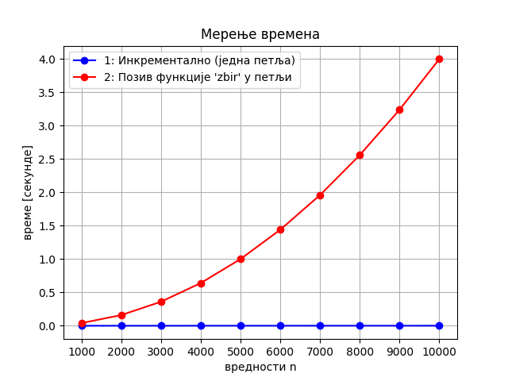

Сложеност алгоритама
====================

Важно питање за практичну примену написаних програма је то колико
ресурса програм захтева за своје извршавање. Најважнији ресурси су
сигурно време потребно за извршавање програма и заузета меморија, мада
се могу анализирати и други ресурси (на пример, код мобилних уређаја
важан ресурс је утрошена енергија). Дакле, обично се разматрају:

-  временска сложеност алгоритма;
-  просторна (меморијска) сложеност алгоритма.

На пример, ако један програм израчунава потребан број за 10 секунди, а
други за два и по минута, јасно је да је први програм практично
примењивији. Међутим, ако први програм за своје извршавање захтева преко
10 гигабајта меморије, други око 1 гигабајт, а ми имамо рачунар са 4
гигабајта меморије, први програм нам је практично неупотребљив (иако
ради много брже од другог). Ипак, с обзиром на то да савремени
рачунарски системи имају прилично велику количину меморије, време је
чешће ограничавајући фактор и у наставку ћемо се чешће бавити анализом
временске ефикасности алгоритама.

При том, прилично је релативно колико брзо програм треба да ради да
бисмо га сматрали ефикасним. На пример, ако програм успе да за пола сата
реши неки нерешен математички проблем, који људи годинама нису могли да
реше, он је свакако користан и можемо га сматрати веома ефикасним. Са
друге стране, ако програм уграђен у аутомобил контролише кочнице
приликом проклизавања, њему и неколико стотина милисекунди израчунавања
може бити превише, јер ће за то време аутомобил неконтролисано слетети
са пута.

Понашање програма (па и количина утрошених ресурса), наравно, зависи од
његових улазних параметара. Јасно је, на пример, да ће програм брже
израчунати просечну оцену двадесетак ученика једног одељења, него
просечну оцену неколико десетина хиљада ученика који полажу Државну
матуру. Такође се може претпоставити да понашање програма не зависи од
конкретних оцена које су ученици добили, већ само од броја ученика. Зато
сложеност алгоритма често изражавамо у функцији величине његових улазних
параметара, а не самих вредности параметара. Величина улазне вредности
може бити број улазних елемената које треба обрадити, број битова
потребних за записивање улаза који треба обрадити, сам улазни број који
треба обрадити итд. Увек је потребно експлицитно навести у односу на
коју величину улазне вредности се разматра сложеност.

Са друге стране, неки се алгоритми не извршавају исто за све улазе исте
величине, па је потребно наћи начин за описивање ефикасности алгоритма
на разним могућим улазима исте величине.

-  Анализа најгорег случаја заснива процену сложености алгоритма на
   најгорем случају (на случају за који се алгоритам најдуже извршава —
   у анализи временске сложености, или на случају за који алгоритам
   користи највише меморије — у анализи просторне сложености). Та
   процена може да буде варљива, тј. превише песимистична. На пример,
   ако се програм у 99,9% случајева извршава испод секунде, док се само
   у 0,1% случајева извршава за око 10 секунди, анализом најгорег
   случаја закључили бисмо да ће се програм извршавати за око 10
   секунди. Са друге стране, анализа најгорег случаја нам даје јаке
   гаранције да програм који је у најгорем случају довољно ефикасан у
   свим случајевима може да се изврши са расположивим расурсима.

-  У неким ситуацијама могуће је извршити анализу просечног случаја и
   израчунати просечно време извршавања алгоритма, али да би се то
   урадило, потребно је прецизно познавати простор допуштених улазних
   вредности и вероватноћу да се свака допуштена улазна вредност појави
   на улазу програма. У случајевима када је битна гаранција ефикасности
   сваког појединачног извршавања програма процена просечног случаја
   може бити варљива, превише оптимистична, и може да се деси да у неким
   ситуацијама програм не може да се изврши са расположивим ресурсима.
   На пример, анализа просечног случаја би за претходни програм
   пријавила да се у просеку извршава испод једне секунде, међутим, за
   неке улазе он се може извршавати и преко десет секунди.

-  Анализа најбољег случаја је, наравно, превише оптимистична и никада
   нема смисла.

Некада се анализа врши тако да се процени укупно време потребно да се
изврши одређен број сродних операција. Тај облик анализе назива се
амортизована анализа и у тим ситуацијама нам није битна расподела
времена на појединачне операције, већ само збирно време извршавања свих
операција.

Мерење времена извршавања
-------------------------

Понашање за конкретне вредности улазних параметара се може
експериментално одредити, тестирањем рада програма. На пример,
размотримо наредна два програма (дата у псеудокоду).

На пример, размотримо наредна два алгоритма који израчунавају све
збирове природних бројева од :math:`1` до :math:`n` (дата у псеудокоду).

.. code:: python

   zbir = 0
   foreach i in [1, n]:
       zbir += i
       print(zbir)

и

.. code:: python

   function zbir(k):
       zbir = 0
       foreach i in [1, k]:
           zbir += i
       return zbir
       
   foreach k in [1, n]:
       print(zbir(k))

Ако се први алгоритам имплементира (на пример, у програмском језику
Python) и ако се измери његово време извршавања за различите вредности
:math:`n`, добијају се следећи резултати.

::

   n =  1000000, rezultat:   500000500000, vreme: 0.16 sekundi
   n =  2000000, rezultat:  2000001000000, vreme: 0.31 sekundi
   n =  3000000, rezultat:  4500001500000, vreme: 0.49 sekundi
   n =  4000000, rezultat:  8000002000000, vreme: 0.65 sekundi
   n =  5000000, rezultat: 12500002500000, vreme: 0.83 sekundi

Већ одавде се види да су времена приближно сразмерна
вредностима :math:`n`. Још прегледнији начин да уочимо ову
пропорционалност је приказивање графика времена израчунавања суме у
зависности од :math:`n`, са кога се сасвим јасно види да код првог
програма време извршавања линеарно зависи од :math:`n`.

   Линеарна зависност измереног времена

Ако се други алгоритам имплементира и ако се измери његово време
извршавања (на пример, у програмском језику Python), добијају се следећи
резултати. 

::

   n =  1000, rezultat:   500500, vreme:    31.24 ms
   n =  2000, rezultat:  2001000, vreme:   156.25 ms
   n =  3000, rezultat:  4501500, vreme:   359.35 ms
   n =  4000, rezultat:  8002000, vreme:   633.19 ms
   n =  5000, rezultat: 12502500, vreme:   993.25 ms
   n =  6000, rezultat: 18003000, vreme:  1448.38 ms
   n =  7000, rezultat: 24503500, vreme:  1984.94 ms
   n =  8000, rezultat: 32004000, vreme:  2547.53 ms
   n =  9000, rezultat: 40504500, vreme:  3291.45 ms
   n = 10000, rezultat: 50005000, vreme:  4049.11 ms

У овом случају зависност није линеарна. Наиме, када се :math:`n`
удвостручи, време се уместо 2 пута, отрпилике увећа 4 пута, што показује
да је у питању квадратна зависност. Емпиријски се увиђа да је понашање
времена (а то зависи од програмског језика и конкретног рачунара на ком
је мерење извршено), такође квадратна функција
:math:`f(n) = 0.00004 n^2`, што је апсолутно у складу са нашом анализом
броја извршених инструкција сабирања. График поново ово веома јасно
приказује.

   Квадратна зависност измереног времена

Ова анализа показује да је први програм неупоредиво бржи у односу на
други. Линеарно време извршавања је толико мање од квадратног, тако да
када се нацрта у размери, делује да је линеарно време стално једнако
нули.

   Однос линеарног и квадратног времена

Асимптотска анализа сложености
------------------------------

Иако се мерење времена извршавња може урадити за сваки програм, често
нам је потребно да можемо да унапред дамо неку грубу процену потребних
ресурса за произвољне улазне вредности, без покретања програма (па чак и
пре писања програма, само на основу алгоритма који ће бити примењен).

Питање које се природно поставља је то на ком ће се рачунару програм
извршавати. Наравно, ако је један рачунар два пута бржи (у неком
сегменту) од другог, за очекивати је да ће се програм на њему извршавати
два пута брже. Ипак, показаће се да су разлике између ефикасних и
неефикасних алгоритама толико велике, да је то што је неки рачунар 2, 3
или чак 10 пута бржи од другог заправо небитно и не може да надомести то
колико је неефикасан алгоритам лошији од ефикасног. На пример, наредна
слика приказује како би изгледао однос времена извршавања ако би се бржи
алгоритам извршавао на 1000 пута споријем рачунару. Као што видимо,
линеарна функција се мало “одлепила” од нуле, међутим, и даље је много
бржа од квадратне (и што је :math:`n` веће, она је све више бржа).

   Однос линеарног и квадратног времена на рачунарима различите брзине

Да бисмо проценили зависност времена извршавања од димензије проблема,
основни приступ је да покушамо да конструишемо функцију :math:`f(n)`
која одређује зависност броја инструкција које алгоритам треба да изврши
у односу на величину улаза :math:`n`.

Израчунајмо број наредби сабирања које се изврше у првом и у другом
програму из претходног примера (програми извршавају и друге наредбе,
попут оних потребних да се организују петље, међутим, претпоставићемо да
су нам сабирања једион значајна).

Јасно је да се у првом програму врши једно сабирање по петљи, па је
укупан број сабирања једнак броју корака извршавања петље, а то је
:math:`n`. Ово је линеарна зависност, што је у складу са измереним
временима.

У другом програму анализа је мало компликованија. За било које дато
:math:`k`, функција ``zbir`` врши око :math:`k` сабирања. Пошто се
функција позива за све вредности :math:`k` од 1 до :math:`n`, то се у
купно изврши
:math:`1 + 2 + \ldots + n = \frac{n(n+1)}{2} = \frac{1}{2}n^2 + \frac{1}{2}n`
сабирања. И ако бисмо рачулани све инструкције, добили бисмо да је број
инструкција нека квадратна функција облика :math:`an^2 + bn + c`, што је
опет у складу са измереним временима.

Ако (поједностављено) претпоставимо да се свака инструкција на рачунару
извршава за једну наносекунду (:math:`10^{-9}s`), а да број инструкција
зависи од величине улаза :math:`n` на основу функције :math:`f(n)`, тада
је време потребно да се алгоритам изврши дат у следећим табелама.

Алгоритми чија је сложеност одозго ограничена полиномијалним функцијама,
у принципу се сматрају ефикасним.

================ =================== =========================== ================== =================== ================= ================================
:math:`n / f(n)` :math:`\log{n}`     :math:`\sqrt{n}`            :math:`n`          :math:`n\log{n}`    :math:`n^2`       :math:`n^3`
================ =================== =========================== ================== =================== ================= ================================
10               0,003 :math:`\mu s` 0,003 :math:`\mu s`         0,01 :math:`\mu s` 0,033 :math:`\mu s` 0,1 :math:`\mu s` 1 :math:`\mu s`
100              0,007 :math:`\mu s` :math:`0,010` :math:`\mu s` 0,1 :math:`\mu s`  0,644 :math:`\mu s` 10 :math:`\mu s`  1 :math:`ms`
1,000            0,010 :math:`\mu s` :math:`0,032` :math:`\mu s` 1,0 :math:`\mu s`  9,966 :math:`\mu s` 1 :math:`ms`      1 :math:`s`
10,000           0,013 :math:`\mu s` :math:`0,1` :math:`\mu s`   10 :math:`\mu s`   130 :math:`\mu s`   0,1 :math:`s`     16,7 :math:`min`
100,000          0,017 :math:`\mu s` :math:`0,316` :math:`\mu s` 100 :math:`\mu s`  1,67 :math:`ms`     10 :math:`s`      11,57 :math:`dan`
1,000,000        0,020 :math:`\mu s` 1 :math:`\mu s`             1 :math:`ms`       19,93 :math:`ms`    16,7 :math:`min`  31,7 :math:`god`
10,000,000       0,023 :math:`\mu s` 3,16 :math:`\mu s`          10 :math:`ms`      0,23 :math:`s`      1,16 :math:`dan`  :math:`3\times 10^5` :math:`god`
100,000,000      0,027 :math:`\mu s` 10 :math:`\mu s`            0,1 :math:`s`      2,66 :math:`s`      115,7 :math:`dan`
1,000,000,000    0,030 :math:`\mu s` 31,62 :math:`\mu s`         1 :math:`s`        29,9 :math:`s`      31,7 :math:`god` 
================ =================== =========================== ================== =================== ================= ================================

Алгоритми чија је сложеност одоздо ограничена експоненцијалном или
факторијелском функцијом се сматрају неефикасним.

================ ==================================== =====================================
:math:`n / f(n)` :math:`2^n`                          :math:`n!`
================ ==================================== =====================================
10               1 :math:`\mu s`                      3,63 :math:`ms`
20               1 :math:`ms`                         77,1 :math:`god`
30               1 :math:`s`                          :math:`8,4\times 10^{15}` :math:`god`
40               18,3 :math:`min`                    
50               13 :math:`dan`                      
100              :math:`4 \times 10^{13}` :math:`god`
================ ==================================== =====================================

Можемо поставити и питање која се димензија улаза се отприлике може
обрадити за одређено време. Одговор је дат у наредној табели.

============= ====================== ===================== =============== ============= =========== ==========
:math:`t`     :math:`n`              :math:`n\log{n}`      :math:`n^2`     :math:`n^3`   :math:`2^n` :math:`n!`
============= ====================== ===================== =============== ============= =========== ==========
:math:`1ms`   :math:`10^6`           :math:`63,000`        :math:`1,000`   :math:`100`   :math:`20`  :math:`9`
:math:`10ms`  :math:`10\cdot 10^6`   :math:`530,000`       :math:`3,200`   :math:`215`   :math:`23`  :math:`10`
:math:`100ms` :math:`100\cdot 10^6`  :math:`4,5\cdot 10^6` :math:`10,000`  :math:`465`   :math:`27`  :math:`11`
:math:`1s`    :math:`10^9`           :math:`40\cdot 10^6`  :math:`32,000`  :math:`1,000` :math:`30`  :math:`12`
:math:`1min`  :math:`60\cdot 10^{9}` :math:`1,9\cdot 10^9` :math:`245,000` :math:`3,900` :math:`36`  :math:`14`
============= ====================== ===================== =============== ============= =========== ==========

Из претходних табела јасно је да време извршавања суштински зависи од
функције :math:`f(n)`. На пример, ако поредимо алгоритме код којих је
:math:`f_1(n) = n`, :math:`f_2(n) = 5n`, :math:`f_3(n) = n^2` и
:math:`f_4(n) = 2n^2 + 3n + 2`, јасно нам је да ће се за :math:`n=10^6`,
време извршавања првог и другог алгоритма мерити милисекундама, док ће
се време извршавања трећег и четвртог алгоритма мерити минутима. Код
функције :math:`f_4`, јасно је да је време које потиче од фактора
:math:`3n` (три милисекунде) и :math:`2` (две нанонсекунде) апсолутно
занемариво у односу на време које долази од фактора :math:`2n^2` (око 33
минута). За прва два алгоритма рећи ћемо да имају *линеарну временску
сложеност*, а за друга два да имају *квадратну временску сложеност*.

Чак ни педесет пута бржи рачунар неће помоћи да се трећи или четврти
алгоритам изврше брже од првог или другог. Иако смо поједностављено
претпоставили да се све инструкције извршавају исто време (једну
наносекунду), што није случај у реалности, из претходних табела је јасно
да нам тај поједностављени модел даје сасвим добру основу за поређење
различитих алгоритама и да прецизнија анализа не би ни по чему значајно
променила ситуацију. Сложеност се обично процењује на основу изворног
кода програма. Савремени компилатори извршавају различите напредне
оптимизације и машински кôд који се извршава може бити прилично
другачији од изворног кода програма (на пример, компилатор може скупу
операцију множења заменити ефикаснијим битовским операцијама, може
наредбу која се више пута извршава у петљи изместити ван петље и
слично). Детаљи који се у изворном коду не виде, попут питања да ли се
неки податак налази у кеш-меморији или је потребно приступати РАМ-у,
такође могу веома значајно да утичу на стварно време извршавања
програма. Савремени процесори подржавају проточну обраду и паралелно
извршавање инструкција, што такође чини стварно понашање програма
другачијим од класичног, секвенцијалног модела који се најчешће
подразумева приликом анализе алгоритама. Дакле, стварно време извршавања
програма зависи од карактеристика конкретног рачунара на ком се програм
извршава, али и од карактеристика програмског преводиоца, па и
оперативног система на ком се програм извршава. Међутим, поново
наглашавамо да ништа од тих фактора не може променити однос између
времена извршавања алгоритама линеарне и алгоритама квадратне
сложености, за велике улазе (код малих улаза, сви алгоритми раде веома
ефикасно, па нам обрада малих улаза није интересантна).

Дакле, можемо закључити да нам за је за грубу процену времена потребног
за извршавање неког алгоритма, чији број инструкција полиномијално
зависи од величине улаза :math:`n` довољно да знамо само који је степен
тог полинома. Можемо слободно да занемаримо све мономе мањег степена, а
можемо и слободно да занемаримо коефицијенте уз водећи степен, као и
коефицијент којим се одређује брзина стварног рачунара у односу на овај
фиктивни, за који смо приказали времена. Наиме у реалним ситуацијама сви
ти коефицијенти могу да утичу да ће програм бити бржи или спорији
највише десетак пута (па нек је и стотинак) пута, али не могу да утичу
на то да се за велики улаз алгоритам чији је број инструкција квадратни
изврши брже од алгоритма чији је број инструкција линеаран (говоримо о
односу минута и милисекунди).

Горња граница сложености се обично изражава коришћењем
:math:`О`-нотације.

**Дефиниција:** Ако постоје позитивна реална константа :math:`c` и
природан број :math:`n_0` такви да за функције :math:`f` и :math:`g` над
природним бројевима важи :math:`f(n) \leq c \cdot g(n)` за све природне
бројеве :math:`n` веће од :math:`n_0` онда пишемо :math:`f(n)=O(g(n))` и
читамо “:math:`f` је велико ,о\` од :math:`g`”.

У неким случајевима користимо и ознаку :math:`\Theta` која нам не даје
само горњу границу, већ прецизно описује асимптотско понашање.

**Дефиниција:** Ако постоје позитивне реалне константе :math:`c_1` и
:math:`c_2` и природан број :math:`n_0` такви да за функције :math:`f` и
:math:`g` над природним бројевима важи
:math:`c_1 \cdot g(n) \leq f(n) \leq c_2 \cdot g(n)` за све природне
бројеве :math:`n` веће од :math:`n_0`, онда пишемо
:math:`f(n)=\Theta(g(n))` и читамо ,,\ :math:`f` је велико ‘тета’ од
:math:`g`\ \``.

Дакле, асимптотским ознакама смо занемарили мономе мањег степена и
сакрили константе уз највећи степен полинома. Стварно време извршавања
зависи и од константи сакривених у асимптотским ознакама, међутим,
асимптотско понашање обично прилично добро одређује његов ред величине
(да ли су у питању микросекунде, милисекунде, секунде, минути, сати,
дани, године).

Наведимо карактеристике основних класа сложености.

-  :math:`O(\log{n})` - изузетно ефикасно, нпр. бинарна претрага;
-  :math:`O(\sqrt{n})` - “логаритам за оне са јефтинијим улазницама” -
   немамо најбоља места, али ипак можемо да гледамо утакицу, нпр.
   испитивање да ли је број прост, факторизација броја на просте
   чиниоце;
-  :math:`O(n)` - оптимално, када је за решење потребно погледати цео
   улаз, нпр. минимум/максимум;
-  :math:`O(n\log{n})` - “линеарни алгоритам за оне са јефтинијим
   улазницама”, алгоритми засновани на декомпозицији, сортирању,
   коришћењу структура података са логаритамским временом приступа, нпр.
   сортирање обједињавањем;
-  :math:`O(n^2)` - угнежђене петље, нпр. сортирање селекцијом;
-  :math:`O(n^3)` - вишеструко угнежђене петље, нпр. множење матрица;
-  :math:`O(2^n)` - испитивање свих подскупова;
-  :math:`O(n!)` - испитивање свих пермутација.

Савети за побољшање сложености
------------------------------

Кључни савет за побољшање сложености је то да рачунар ради само оно што
је неопходно да би се добио коначан резултат. Када се та идеја мало
детаљније разради, добијамо следећи низ савета који нас често доводе до
алгоритама мање сложености:

-  Немој терати рачунар да врши дуготрајна израчунавања која се могу
   извршити и “пешке”, применом математике.
-  Немој терати рачунар да више пута израчунава једно те исто – упамти
   потребне резултате израчунавања у меморији, да их не би рачунао више
   пута.
-  Немој терати рачунар да израчунава ствари које нису потребне за
   добијање коначног решења проблема.
-  Немој терати рачунар да испитује случајеве за које унапред можеш
   закључити да не могу бити тражено решење проблема.
-  Ако је то могуће, припреми податке тако да се касније могу ефикасније
   обрадити.
-  Користи ефикасније структуре података.
-  …

У наставку овог поглавља приказаћемо низ задатака које ћемо решити
различитим алгоритмима, анализираћемо њихову асимптотску сложеност
најгорег случаја и приказаћемо како се на бази приказаних савета могу
изградити значајно ефикаснији алгоритми.
